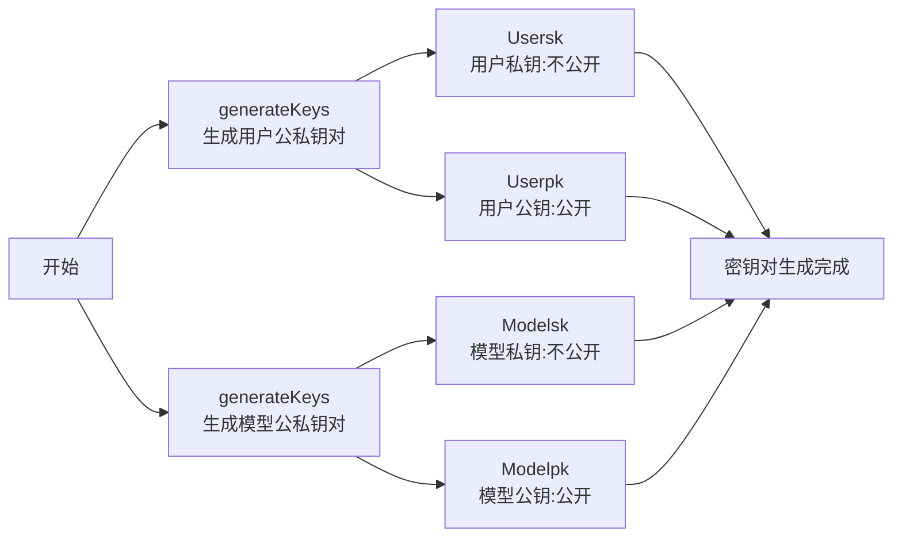
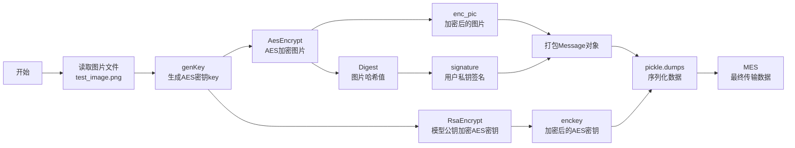
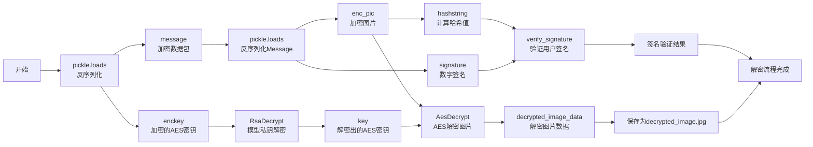

### 生成公私钥对

```mermaid
graph LR
    A[开始] --> B[generateKeys<br/>生成用户公私钥对]
    B --> C[Usersk<br/>用户私钥:不公开]
    B --> D[Userpk<br/>用户公钥:公开]
    
    A --> E[generateKeys<br/>生成模型公私钥对]
    E --> F[Modelsk<br/>模型私钥:不公开]
    E --> G[Modelpk<br/>模型公钥:公开]
    
    C & D & F & G --> H[密钥对生成完成]
```
### 加密流程

```mermaid
graph LR
    A[开始] --> B[读取图片文件<br/>test_image.png]
    B --> C[genKey<br/>生成AES密钥key]
    C --> D[AesEncrypt<br/>AES加密图片]
    D --> E[enc_pic<br/>加密后的图片]
    
    C --> F[RsaEncrypt<br/>模型公钥加密AES密钥]
    F --> G[enckey<br/>加密后的AES密钥]
    
    D --> H[Digest<br/>图片哈希值]
    H --> J[signature<br/>用户私钥签名]
    
    
    E & J --> K[打包Message对象]
    K & G --> L[pickle.dumps<br/>序列化数据]
    L --> M[MES<br/>最终传输数据]
    
```

### 解密流程

```mermaid
graph LR
    A[开始] --> B[pickle.loads<br/>反序列化]
    
    B --> D[enckey<br/>加密的AES密钥]
    B --> E[message<br/>加密数据包]
    
    D --> F[RsaDecrypt<br/>模型私钥解密]
    F --> G[key<br/>解密出的AES密钥]
    
    E --> H[pickle.loads<br/>反序列化Message]
    H --> I[enc_pic<br/>加密图片]
    H --> J[signature<br/>数字签名]
    
    I --> L[hashstring<br/>计算哈希值]
   
    
    L & J --> M[verify_signature<br/>验证用户签名]
    M --> N[签名验证结果]
    
    I & G --> O[AesDecrypt<br/>AES解密图片]
    O --> P[decrypted_image_data<br/>解密图片数据]
    P --> Q[保存为decrypted_image.jpg]
    N & Q --> R[解密流程完成]
```

